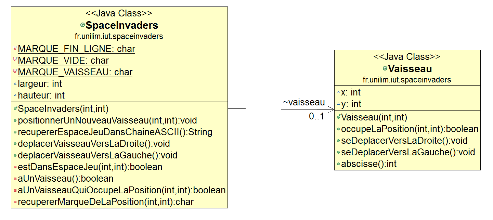
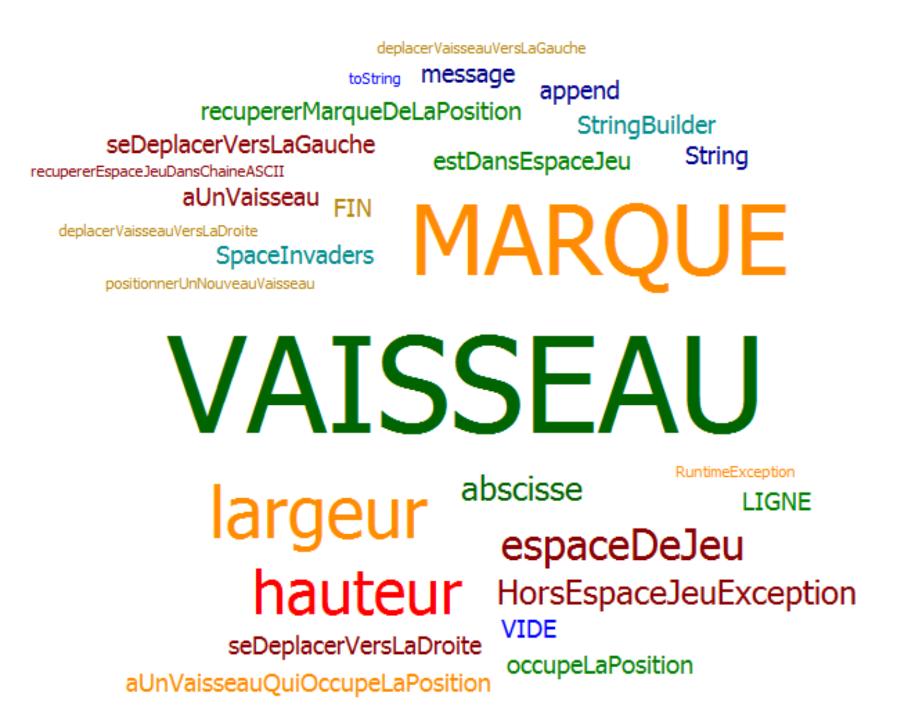

# Envahisseur de l'espace

- [Semaine n°1](#semaine1)
- [Semaine n°2](#semaine2)
- [Semaine n°3](#semaine3)
- [Glossaire](#glossaire)

## Semaine n°1 : 

### Sprints et fonctionnalités réalisées 

#### Fonctionnalité n°1 : Déplacer un vaisseau dans l'espace de jeu (fini)

- Histoire 1 : Créer un espace de jeu  
Un espace de jeu est créé aux dimensions données (2D)   
Cet espace de jeu est vide 

- Histoire n°2 : Positionner un nouveau vaisseau dans l’espace de jeu  
Un nouveau vaisseau est créé  
Le vaisseau est positionné aux coordonnées transmises  
Si un nouveau vaisseau essaye d’être positionné en dehors des limites de l’espace jeu, alors une exception devra être levée.  
Contraintes :  
	-  La position souhaité  est transmise  par ses coordonnées (longueur, hauteur, x, y)  
	- Le coin superieur gauche de l'espace jeu (point en haut à gauche) à coordonnées (0,0)   
	- La taille du vaisseau est réduite dà son minimum pour le moment (1)

- Histoire n°3 : Déplacer le vaisseau vers la droite dans l’espace de jeu  
Le vaisseau se déplace d'un pas vers la droite  
Si le vaisseau se trouve sur la bordure droite de l'espace de jeu, le vaisseau doit rester immobile (aucun déplacement, aucune exception levée : le vaisseau reste juste à sa position actuelle).

- Histoire n°4 : Déplacer le vaisseau vers la gauche dans l'espace de jeu   
Le vaisseau se déplace d'un pas vers la gauche  
Si le vaisseau se trouve sur la bordure gauche de l'espace de jeu, le vaisseau doit rester immobile (aucun déplacement, aucune exception levée : le vaisseau reste juste à sa position actuelle).

### Fonctionnalité en cours d’implémentation :

Aucune

### Diagramme de classes 

### Nuage de mots du projet spaceinvaders (séance n°1)

### Difficultés rencontrées

Aucune

### Remarques diverses

Pour pouvoir, mettre en place les tests, il a été nécessaire d’ajouter une fonctionnalité supplémentaire qui permet de représenter l’espace de jeu dans une chaîne ASCII.

-------------

## Semaine n°2 : 

### fonctionnalités réalisées 

#### Fonctionnalité n°2 : Dimensionner le vaiseau (fini)

- Histoire 1 : Positionner un nouveau vaisseau avec une dimension donnée  
Posionner le vaisseau créé aux dimensions 2D données dans l'espace de jeu  
Hauteur du vaisseau : 2  
Longueur du vaisseau : 3

- Histoire 2 : Impossibilité de positionner un vaisseau qui déborde de l'espace de jeu  
Une fois le vaisseau dimensionné faire en sorte qu'il ne dépasse pas les dimensions de l'espace de jeu  
Si un nouveau vaisseau essaye d’être positionné en dehors des limites de l’espace jeu, alors une exception devra être levée.  
Contraintes:  
	- La position souhaité  est transmise  par ses coordonnées (longueur, hauteur, x, y)  
	- Le coin superieur gauche de l'espace jeu (point en haut à gauche à coordonnées (0,0)  
	- La taille du vaisseau est de 3 de longueur et de 2 de hauteur

- Histoire 3 : Déplacer un vaisseau vers la droite en tenant compte de sa dimension  
Il y a 2 cas possible :  
	- le cas où le vaisseau effectue son déplacement en restant dans l'espace de jeu.  
	- le cas où le vaisseau, étant déjà sur la bordure droite de l'espace jeu, ne peut pas se déplacer au risque de ne plus être dans l'espace de jeu.  

Contraintes:  
	- Tenir compte de la dimension du vaisseau

- Histoire 4 : Déplacer un vaisseau vers la gauche en tenant compte de sa dimension  
Comme pour le cas du déplacement à droite il y a 2 cas possible :  
	- le cas où le vaisseau effectue son déplacement en restant dans l'espace de jeu.  
	- le cas où le vaisseau, étant déjà sur la bordure gauche de l'espace jeu, ne peut pas se déplacer au risque de ne plus être dans l'espace de jeu.  
Création des 2 nouvelles classe Position et Dimension. 

Contrainte :   
	- Tenir compte de la dimension du vaisseau

- Histoire 5 : Refactoring de la classe Test  
Remplacement de l'écriture (longueur, hauteur, x, y) en (new Dimension(3,2),new Position(7,9)) lors de l'appel à la méthode positionnerUnNouveauVaisseau de la classe spaceInvaders  
Supression de la surcharge positionnerUnNouveauVaisseau(int longueur, int hauteur ,int x, int y) pour ne conserver que la méthode positionnerUnNouveauVaisseau(Dimension dimension, Position position)

- Histoire 6 : Refactoring de la classe de Vaisseau  
Suppression des attributs x et y pour les remplacer par un attribut de type Position    
Suppression des attributs longueur et hauteurs pour les remplacer par un attribut de type Dimension   
Ajout d'un constructeur dans la classe Vaisseau.

### Fonctionnalité en cours d’implémentation : 

Fonctionnalité n°3 : choix de la vitesse du vaisseau

### Diagramme de classes 

### Nuage de mots du projet spaceinvaders (séance n°1)

### Difficultés rencontrées

Aucune

-------------

## Glossaire 

* **Vaisseau** :  véhicule commandé par le joueur, pouvant se déplacer de droite à gauche et ayant la possibilité de lancer des missiles destinés à détruire le(s) envahisseurs.

* **Envahisseur**  :  ennemi qui apparaît à l'écran, se déplace automatiquement et qui doit être détruit par un missile lancé depuis le vaisseau du joueur.

* **Missile** :  projectile envoyé à la verticale par le vaisseau vers l'envahisseur dans le but de le détruire.

-------------
